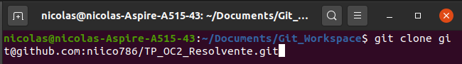
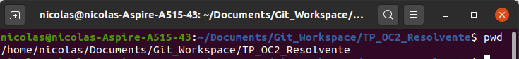
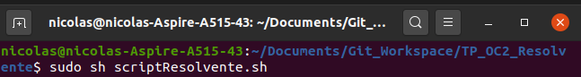
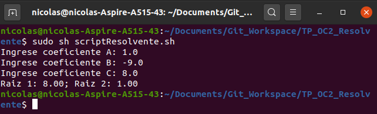

# TP_OC2_Resolvente

Trabajo practico donde se escribe un programa en NASM para resolver la formula
resolvente segun tres coeficientes que son ingresados por el usuario y pasados
como paramteros a partir de un programa en C.

**Como ejecutar la aplicacion desde la consola:**

* Clonar el repositorio:
    * Debemos copiar el repositorio remoto en nuestra maquina personal,
        para hacerlo copiamos la ruta del repositorio de git y junto con con git 
        bash, consola o cliente grafico como GitHubDesktop. Importamos el projecto 
        y lo guardamos en una ubicacion de preferencia.

    
* Una vez que tenemos el proyecto clonado, navegamos en la consola hacia
    la direccion del proyecto por ejemplo C:/Users/MyUser/Docs/Git/TP_OC2_Resolvente
    para Windows o home/MyUser/Documents/Git/TP2_OC2_Resolvente para linux.

* Ejecutamos el archivo script "scriptResolvente.sh". Para hacerlo, ubicados ya
    en la consola en la ubicacion del proyecto ejecutamos el comando:
        *sudo sh scriptResolvente.sh* 

* El programa nos pedira por consola que ingresemos los coeficientes A, B, C para
    calcular la formula resolvente y asi devolver el valor final de las dos raices.
    **NOTAS:** 

    * se da por asumido para las variables las condiciones: 
        * b^2 - 4ac >= 0, ∀ a, b, c ε R
        * a > 0

    * Si se ingresan valores para los coeficientes no calculables para
        la resolvente, el programa devuelve raices invalidas.  

* Al finalizar la ejecucion del programa, podremos ver el resultado de las raices.

